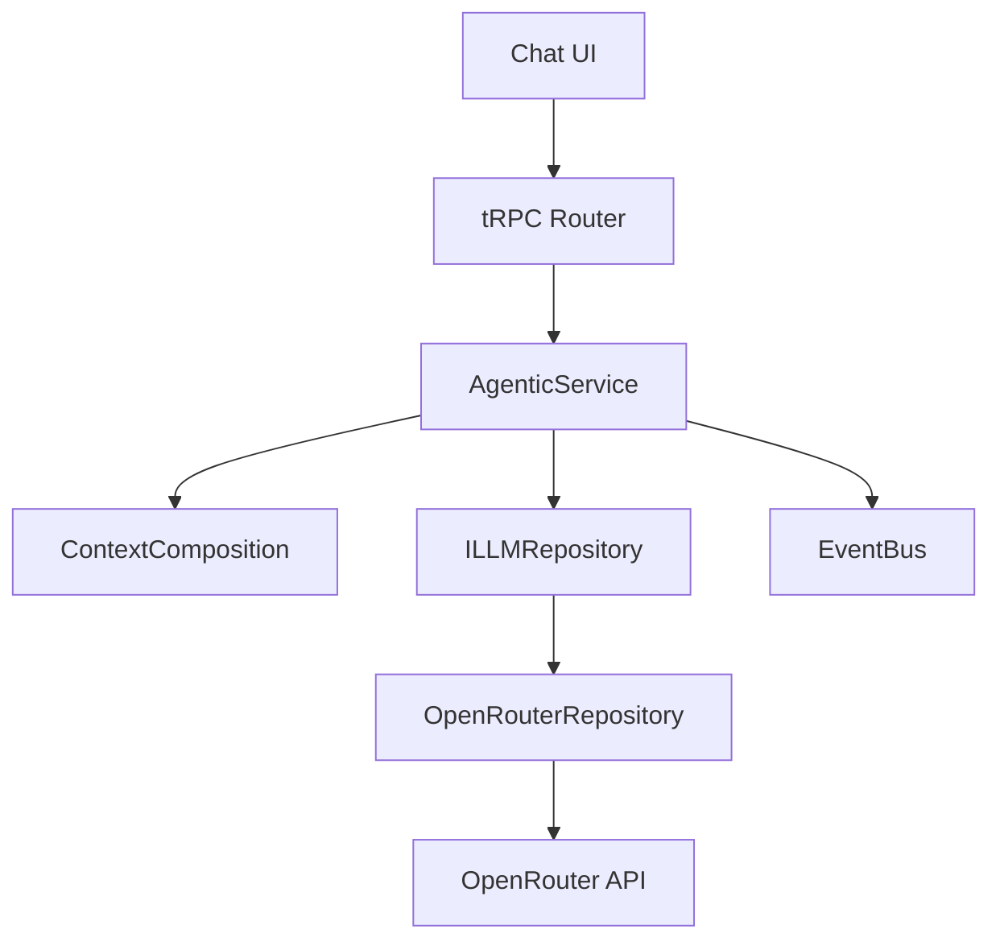
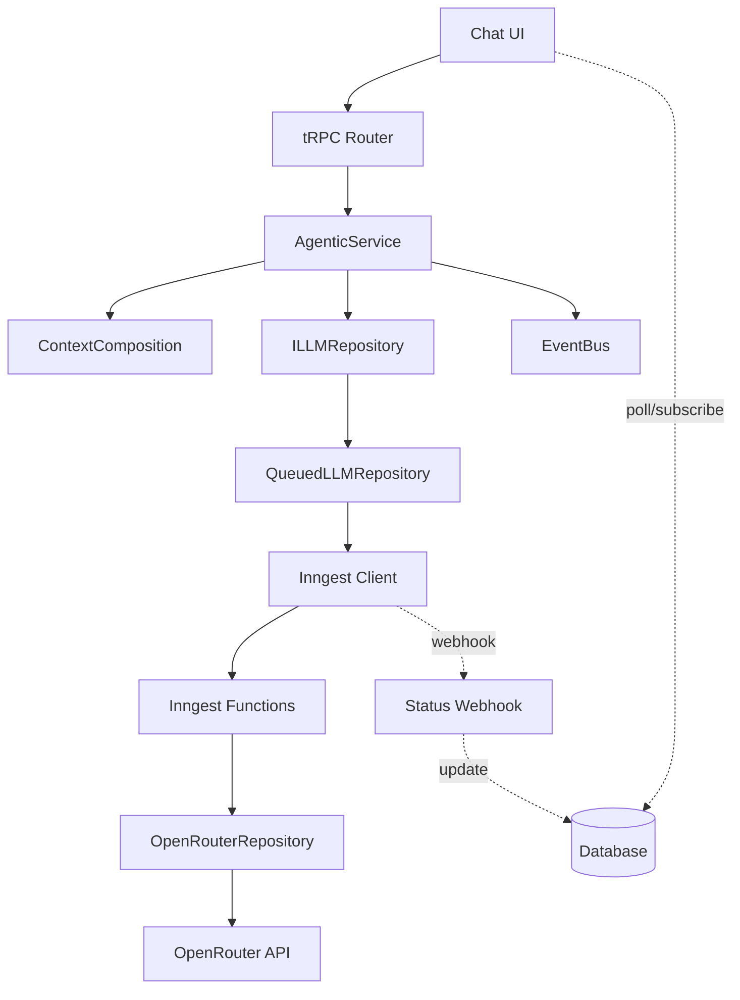

# Inngest Integration Architecture for Agentic Domain

## Executive Summary
Integrate Inngest at the **Repository Implementation Level** to handle LLM request queuing, retries, and long-running operations while maintaining clean domain boundaries.

## Current Architecture Analysis



### Key Components:
1. **tRPC Router** (`/server/api/routers/agentic.ts`) - API endpoint with 30s timeout
2. **AgenticService** - Orchestrates context building and LLM calls
3. **ILLMRepository** - Abstract interface for LLM providers
4. **OpenRouterRepository** - Concrete implementation calling OpenRouter API
5. **EventBus** - Emits events for UI updates

## Proposed Architecture with Inngest



## Integration Points (Only 4 Touchpoints!)

### 1. **New Repository Implementation** (`QueuedLLMRepository`)
**Location**: `/src/lib/domains/agentic/repositories/queued-llm.repository.ts`
```typescript
export class QueuedLLMRepository implements ILLMRepository {
  constructor(
    private readonly baseRepository: ILLMRepository,
    private readonly inngestClient: Inngest
  ) {}

  async generate(params: LLMGenerationParams): Promise<LLMResponse> {
    // Quick requests (< 5s expected) go direct
    if (this.isQuickModel(params.model)) {
      return this.baseRepository.generate(params)
    }
    
    // Long requests go to queue
    const job = await this.inngestClient.send({
      name: "llm/generate.request",
      data: { params, jobId: generateJobId() }
    })
    
    // Return job reference (client will poll)
    return {
      id: job.id,
      content: { type: 'queued', jobId: job.id },
      status: 'pending'
    }
  }
}
```

### 2. **Inngest Function Definition**
**Location**: `/src/lib/domains/agentic/infrastructure/inngest/functions.ts`
```typescript
export const generateLLMResponse = inngest.createFunction(
  {
    id: "llm-generate",
    throttle: {
      limit: 5,
      period: "1m",
      key: "event.data.userId"
    },
    retries: 3,
    cancelOn: [{ event: "llm/generate.cancel" }]
  },
  { event: "llm/generate.request" },
  async ({ event, step }) => {
    // Step 1: Context validation
    const context = await step.run("validate-context", async () => {
      return validateAndPrepareContext(event.data.params)
    })
    
    // Step 2: Call OpenRouter with retries
    const response = await step.run("call-openrouter", async () => {
      const repo = new OpenRouterRepository(process.env.OPENROUTER_API_KEY)
      return repo.generate(event.data.params)
    }, {
      retries: { attempts: 3, delay: "exponential" }
    })
    
    // Step 3: Store result
    await step.run("store-result", async () => {
      await db.jobResults.create({
        jobId: event.data.jobId,
        response,
        status: 'completed'
      })
    })
    
    // Step 4: Notify client (optional webhook)
    await step.run("notify-client", async () => {
      await notifyClient(event.data.jobId, response)
    })
    
    return response
  }
)
```

### 3. **Factory Pattern Update**
**Location**: `/src/lib/domains/agentic/services/agentic.factory.ts`
```typescript
export function createAgenticService(config: AgenticConfig): AgenticService {
  // Existing context composition setup...
  
  // Choose repository based on environment
  let llmRepository: ILLMRepository
  
  if (config.useQueue && config.inngestClient) {
    // Wrap with queue for production
    const baseRepo = new OpenRouterRepository(config.openRouterApiKey)
    llmRepository = new QueuedLLMRepository(baseRepo, config.inngestClient)
  } else {
    // Direct for development
    llmRepository = new OpenRouterRepository(config.openRouterApiKey)
  }
  
  return new AgenticService(
    llmRepository,
    contextComposition,
    config.eventBus
  )
}
```

### 4. **tRPC Router Update** (Minimal Change)
**Location**: `/src/server/api/routers/agentic.ts`
```typescript
// Add job status endpoint
export const agenticRouter = createTRPCRouter({
  // Existing generateResponse stays the same!
  generateResponse: protectedProcedure
    .mutation(async ({ input }) => {
      // No changes needed - returns job ID for queued requests
      const response = await agenticService.generateResponse(...)
      return response
    }),
  
  // NEW: Check job status
  getJobStatus: protectedProcedure
    .input(z.object({ jobId: z.string() }))
    .query(async ({ input }) => {
      const result = await db.jobResults.findUnique({
        where: { jobId: input.jobId }
      })
      return result
    }),
    
  // NEW: Subscribe to updates (using tRPC subscriptions)
  onJobUpdate: protectedProcedure
    .input(z.object({ jobId: z.string() }))
    .subscription(async function* ({ input }) {
      // Poll database for updates
      while (true) {
        const result = await db.jobResults.findUnique({
          where: { jobId: input.jobId }
        })
        if (result?.status === 'completed' || result?.status === 'failed') {
          yield result
          break
        }
        yield result
        await sleep(1000)
      }
    })
})
```

## Client-Side Changes (Minimal)

**Location**: `/src/app/map/Chat/_hooks/useAIChat.ts`
```typescript
export function useAIChat() {
  // Existing mutation stays the same
  const generateResponseMutation = api.agentic.generateResponse.useMutation({
    onSuccess: (response) => {
      if (response.status === 'pending') {
        // Start polling for queued job
        startJobPolling(response.id)
      } else {
        // Immediate response (quick model)
        chatState.sendAssistantMessage(response.content)
      }
    }
  })
  
  // NEW: Poll for job completion
  const startJobPolling = (jobId: string) => {
    const subscription = api.agentic.onJobUpdate.useSubscription({
      jobId,
      onData: (result) => {
        if (result.status === 'completed') {
          chatState.sendAssistantMessage(result.response.content)
        }
      }
    })
  }
}
```

## Benefits of This Architecture

### Clean Separation of Concerns
- **Domain logic unchanged**: AgenticService doesn't know about queuing
- **Repository pattern preserved**: Queue is just another implementation
- **Single Responsibility**: Each component has one clear job

### Minimal Touchpoints
1. One new repository implementation
2. One Inngest function file
3. One factory update
4. One tRPC endpoint addition

### Progressive Enhancement
- **Development**: Direct calls (no queue)
- **Production**: Automatic queuing for long operations
- **Fallback**: Works without Inngest (degrades gracefully)

### Observability
- Inngest dashboard shows all jobs
- Built-in retry visualization
- Performance metrics included

## Implementation Steps

### Phase 1: Setup (30 min)
```bash
# Install Inngest
pnpm add inngest

# Add to environment variables
INNGEST_EVENT_KEY=your-key
INNGEST_SIGNING_KEY=your-signing-key
```

### Phase 2: Core Implementation (2 hours)
1. Create `QueuedLLMRepository`
2. Create Inngest functions
3. Update factory
4. Add job status table to database

### Phase 3: Client Updates (1 hour)
1. Add polling logic
2. Update UI for pending states
3. Add job cancellation

### Phase 4: Testing (1 hour)
1. Test direct path (quick models)
2. Test queued path (slow models)
3. Test failure/retry scenarios

## Database Schema Addition

```sql
-- Simple job tracking table
CREATE TABLE llm_job_results (
  id TEXT PRIMARY KEY,
  job_id TEXT UNIQUE NOT NULL,
  user_id TEXT NOT NULL,
  status TEXT NOT NULL, -- 'pending', 'processing', 'completed', 'failed'
  response JSONB,
  error TEXT,
  created_at TIMESTAMP DEFAULT NOW(),
  updated_at TIMESTAMP DEFAULT NOW()
);

CREATE INDEX idx_job_status ON llm_job_results(job_id, status);
```

## Configuration

```typescript
// .env additions
INNGEST_EVENT_KEY=xxx
INNGEST_SIGNING_KEY=xxx
USE_QUEUE=true  # Enable queuing in production

// For different models
QUICK_MODELS=gpt-4o-mini,claude-3-haiku  # Direct path
SLOW_MODELS=deepseek-r1,o1-preview       # Queue path
```

## Monitoring & Debugging

### Inngest Dashboard Shows:
- Queue depth
- Processing times
- Retry attempts
- Error rates
- Model-specific metrics

### Custom Metrics:
```typescript
// Track in Inngest function
await step.run("track-metrics", async () => {
  metrics.record('llm.queue.depth', queueDepth)
  metrics.record('llm.processing.time', processingTime)
  metrics.record('llm.model.usage', { model: params.model })
})
```

## Rollback Plan

If issues arise, disable queuing instantly:
```typescript
// Set USE_QUEUE=false in environment
// System automatically falls back to direct calls
// No code changes needed!
```

## Summary

**Total Changes Required**: 4 files
**New Files**: 2 (repository + functions)
**Modified Files**: 2 (factory + router)
**Client Changes**: Minimal (add polling)
**Risk**: Low (feature flag controlled)
**Rollback**: Instant (environment variable)